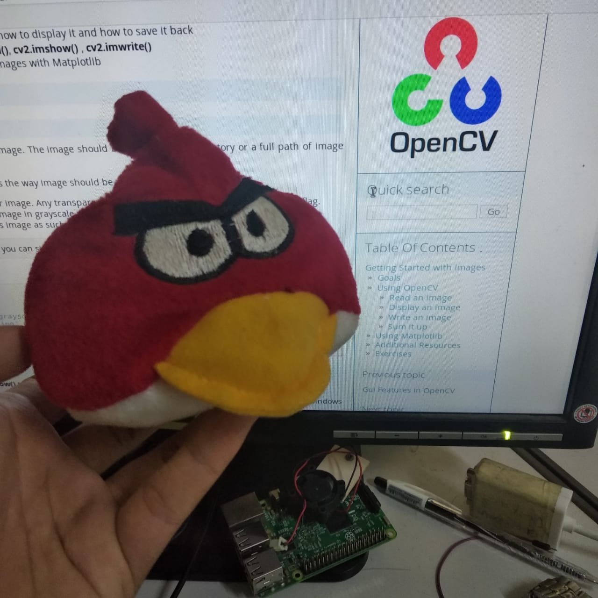
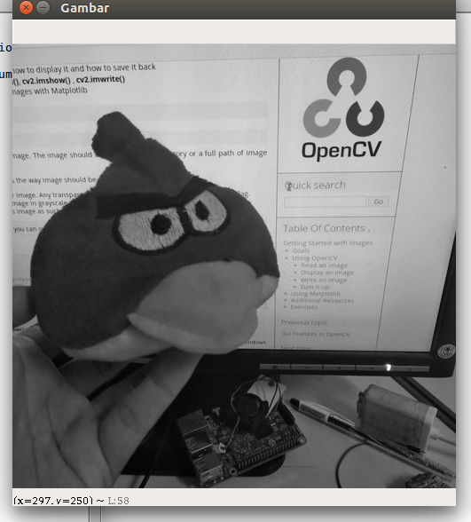
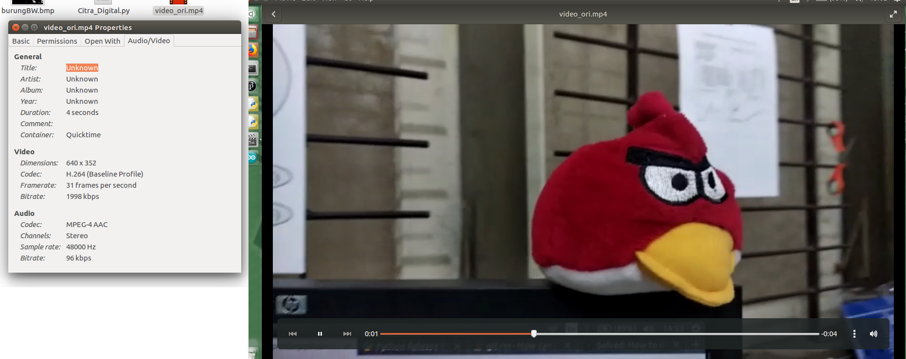
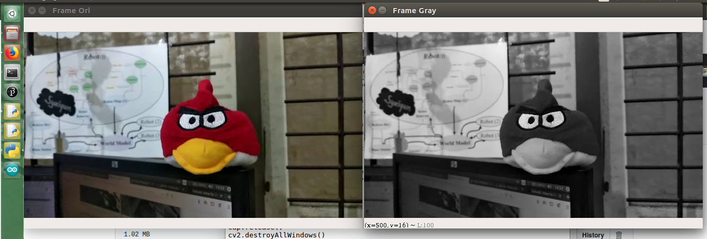
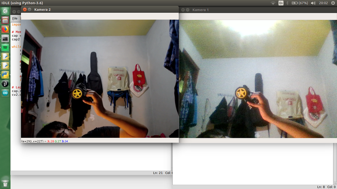
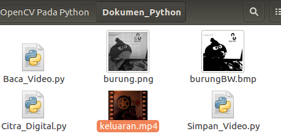

# 1. Yuk mengenal OpenCV Python

<b>OpenCV</b> (open source computer vision) merupakan sebuah pustaka bahasa pemograman yang ditujukan untuk penggunaan pengolahan citra secara waktu nyata. Secara original, OpenCV dikembangkan oleh Intel, kemudian didukung oleh [Willow Garage](https://en.wikipedia.org/wiki/Willow_Garage) dan kemudian Itseez (yang diakuisisi oleh Intel). Pustaka OpenCV sudah mendukung lintas platform dan dapat digunakan dengan gratis untuk digunakan di bawah [lisensi BSD](https://en.wikipedia.org/wiki/BSD_licenses) Open-source. Dalam perkembangannnya, OpenCV sudah mendukung beberapa framework untuk [deep-learning](https://en.wikipedia.org/wiki/Deep_learning) seperti [TensorFlow](https://en.wikipedia.org/wiki/TensorFlow), [YOLO](https://pjreddie.com/darknet/yolo/), [Torch/PyTorch](https://en.wikipedia.org/wiki/PyTorch) dan [Caffee](https://en.wikipedia.org/wiki/Caffe_(software)). Beberapa model terbaru yang mendukung ada pada [daftar berikut ini](https://docs.opencv.org/master/d2/d58/tutorial_table_of_content_dnn.html). 

## - OpenCV-Python

Ya, pada tutorial kali ini, kita akan menggunakan Python untuk membahas OpenCV-nya. Jadi, jika kalian masih belum paham atau pengen belajar tentang Python, bisa membaca tutorial Dasar Python sebelumnya pada [tautan berikut](https://github.com/yogidm/Dasar-Python). *) jangan lupa untuk di-star ya repo nya...

Mengapa Python? kurang lebih karena bahasa Python lebih mudah dibaca dalam Bahasa Inggris. Selain itu, juga lumayan cepat dalam komputasinya, meski tak secepat bahasa C++. Akan tetapi, dari kemudahan terbacanya tersebut, dapat memudahkan pembelajar untuk memahaminya. Jadi, tetap semangat ya untuk belajar hal yang mungkin baru. 

Untuk Python yang akan digunakan pada tutorial ini adalah versi `Python 3.6.x` sedangkan untuk OpenCV nya digunakan `OpenCV 4.1.x`

## - Tentang tutorial ini

Tutorial ini ditujukan untuk kalian yang baru atau belum penah memahami OpenCV sebagai sebuah pustaka pada bahasa pemograman. Oleh karenanya, tutorial ini berisi tentang sedikit teori dasar dari pengolahan citra digital yang nantinya akan diberi tutorial penggunaannya menggunakan pustaka OpenCV. Ya, setidaknya kalian sudah membaca bagaimana toeri yang sebenarnya terjadi pada tiap pustaka dan fungsinya. Kebanyakan pada pustaka OpenCV hanya disediakan fungsi-fungsi yang sudah jadi saja. Selain itu, pada akhir pembahasan tiap bab nya, akan kami sematkan sebuah video yang bisa kalian gunakan sebagai suplemen atau patokan tutorialnya bekerja. 

Apabila kalian mengalami permasalahan pada contoh kode yang disematkan atau ingin berkontribusi pada Tutorial Dasar OpenCV ini, kalian bisa email kami pada de.mhnd[at]gmail[dot]com

## - Apa saja keuntungannya?

Keuntungannya mungkin tidak ada selain hanya sharing ilmu tentang OpenCV menggunakan Pyhton. Jadi, kalian bisa menggunakan ilmu yang ada didalamnya untuk kebutuhan kalian pribadi atau yang lainnya. tetapi bukan tulisannya ya... lantas kalian langsung menduplikat semua atau sebagian isi dari tutorial ini untuk dibuat buku, skripsi, atau laporan kalian. Bukan begitu cara mainnya. Kami hanya membagi ilmu ini dalam Bahasa Indonesia. 

`Sharing is Caring`. 

## - Ayo mulai belajar!

Langkah pertama yang bisa kalian buat adalah membuat akun [github](https://github.com/) dan mem-fork atau star tutorial ini agar kalian mudah mencari atau kalian bisa bookmark tutorial ini pada browser kalian. 

### Contributor
- [yogidm](https://github.com/yogidm)


# 2. Instalasi OpenCV-Python

> Target pembahasan:
> - Cara instalasi pada Windows
> - Cara instalasi pada Linux/Ubuntu
> - Tes keberhasilan instalasi


Ada beberapa sistem operasi yang sering digunakan di Indonesia, yaitu Windows, Linux dan Mac. Nah, kita akan menjelaskan dasar instalasinya. 

## - Instalasi pada Windows

- Download Python 3.6.x pada tautan [berikut](https://www.python.org/downloads/release/python-368/) (Release Date: Dec. 24, 2018). Klik dan unduh `Windows x86-64 executable installer` pada daftar tabel di bagian bawah. 


- Double klik file tersebut, dan jangan lupa beri tanda contreng pada <b>Add PATH Python 3.6.x</b>. lalu lanjutkan instalasi Python seperti biasanya. 
- Setelah sudah selesai proses instalasi, barulah kita mulai instalasi OpenCV. Masuk pada `command promt` Windows. `Crtl + R`, ketikkan `cmd`.
- Install opencv-python 4.1.x via pip dengan mengetikkan `pip3 install opencv-python`
- Numpy akan terinstall otomatis satu paket dengan instalasi opencv-python
- Jika instalasi keduanya berhasil, maka selesai dan siap untuk digunakan. Jika masih terjadi error, maka copy and paste errornya pada search engine. Semoga error tersebut ada di `stackoverflow` :D

## - Instalasi pada Ubuntu/Linux

Untuk instalasi pada Ubuntu/Linux, kalian bisa membuka terminal dengan menekan `Ctrl + Alt + T` dan memasukkan perintah berikut:

- Python 3.6.x `sudo apt-get install idle-python3.6`
- OpenCV-Python 4.1.x via pip3 `pip3 install opencv-python`
- Numpy sudah sepaket terinstall dengan OpenCV

## - Instalasi pada Mac

Nah, silahkan cari sendiri ya... Author belum pernah menggunakan mac, jadi kurang lebih sama dengan linux sepertinya. :D

## - Test instalasi kalian

Nah, apakah instalasi kalian sudah benar dan sukses? Kalian bisa membuat sebuah demo untuk mengakusisi citra dari kamera webcam kalian. 

- Buka `IDLE Using Python 3.6` sebagai editor Python kalian. 
- Buat `New File` 
- Masukkan kode berikut ini:

```python
import cv2
cap=cv2.VideoCapture(0)

while(True):
    ret,frame=cap.read()
    cv2.imshow('frame', frame)
    if cv2.waitKey(1) & 0xFF == ord('q'):
        break
        
cap.release()
cv2.destroyAllWindows()
```

- Simpan dokumen tersebut sesuai keinginan kalian. 
- Run dengan menekan tombol `F5`.
- Kurang lebih akan menunjuukkan tampilan seperti gambar berikut ini. 


- Tekan tombol `q` untuk keluar dari program capture kamera. 

Nah, setelah instalasi kalian sukses, mari kita lanjutkan pada bab selanjutnya. 


# 3. Memulai Fitur GUI pada OpenCV

## 3.1. Menggunakan Citra Digital

> Target pembahasan:
> - Dapat membaca citra dari sebuah file citra digital
> - Dapat menulis citra hasil pengolahan
> - Menampilkan citra pada jendela menggunakan FItur GUI OpenCV
> - Menggunakan keyboard event


### - Membaca Citra Digital
Citra digital dapat kita panggil pada proyek Python kita menggunakan fugnsi `c2.imread()`. Untuk pembacaan citra yang bisa dipanggil, hanya pada direktori yang sama dengan letak direktori dari dokumen Python itu disimpan. Jadi, jangan lupa memindah lokasi gambar yang akan digunakan pada folder yang sama dengan dokumen kalian ya... 

Untuk isian dari `flag` kedua fungsi tersebut, dapat digunakan:
- `cv2.IMREAD_COLOR` : atau `1` yang berartikan memanggil citra berwarna dengan 3 dimensi yaitu BGR. 
- cv2.IMREAD_GRAYSCALE : atau `0` yang memanggil citra dengan 1 dimensi atau citra keabuan
- cv2.IMREAD_UNCHANGED : atau `-1` yang memanggil citra tanpa adanya perubahan seperti citra dengan kanal alpha. 


Coba buat sebuah dokumen baru dan tuliskan kode berikut didalamnya. 

```python
import cv2

# Panggil citra digital dengan nama anu.jpeg
# dan memasukkannya pada variabel img
img = cv2.imread("anu.jpeg", 0)
```
untuk gambar `anu.jpeg` , kita dapat menggunakan gambar berikut. Silahkan [unduh disini](https://github.com/yogidm/opencv-python-indonesia/raw/master/Gambar/anu.jpeg) atau klik kanan gambar dibawah ini lalu `save image as`.



ketika dokumen tersebut sudah disimpan dengan satu direktori dengan gambar tersebut, apabila di `run` maka tidak akan ada tampilan gambar sama sekali hingga kita menampilkannya menggunakan fitur GUI dari OpenCV. 

### - Menampilkan Citra Digital

Menampilkan citra yang sudah dipanggil dan dirubah menjadi sebuah variabel, maka kita bisa menggunakan fungsi `cv2.imshow()` untuk menampilkan citra pada variabel tersebut. Untuk jendela untuk menampilkan citra, akan secara otomatis menyesuaikan dengan ukuran citranya. pada penulisan fungsinya, ada beberapa masukan, yaitu nama windownya dan diikuti dengan nama variabel yang berisikan citra yang akan ditampilkan. Coba kode berikut dibawah kode pembacaan citra digital diatas.

```python
cv2.imshow ('Gambar', img)
cv2.waitKey(0)
cv2.destroyAllWindows()
```

Apabila kalian menjalakan programnya, maka akan menampilkan gambar seperti berikut:



pada baris `cv2.waitKey(0)` merupakan sebuah fungsi untuk menahan frame atau citra yang sedang kita gunakan. Dengan kata lain, apabila kita menggunakan banyak frame, kita tidak perlu menahannya dengan memberikan nilai selain `0`. 

pada baris `cv2.destroyAllWindows()` merupakan sebuah fungsi untuk menutup semua jendela yang aktif pada sebuah program yang berjalan. Biasanya kita bisa menggabungkan dengan perintah `jika tombol 'q' tertekan, maka tutup semua jendela` (seperti pada kode tes instalasi pada bab 2).

### - Menyimpan gambar menjadi sebuah file

Menyimpan gambar hasil pengolahan citra digital pada OpenCV dapat digunakan fungsi 
`cv2.imwrite()`. Untuk nama file, kalian bisa menggunakan `.png` atau `.jpg` atau sesuai dengan kebutuhan kalian. Jika hasil citra kalian dalam bentuk citra biner, gunakan format `.bmp` untuk hasil yang lebih baik. File akan disimpan pada direktori yang sama dengan letak dokumen disimpan. 

```python
cv2.imwrite('burung.png',img)
```

### - Gabungkan semua kodenya

Kode diatas merupakan kepingan kode yang memanggil dan menampilkannya pada jendela menggunakan fitur GUI pada OpenCV. Mari kita gabungkan kesemuanya. 

```python
import cv2

# Panggil citra digital dengan nama anu.jpeg
img = cv2.imread("anu.jpeg", 0)

imb = img.copy() # Buat duplikat dari variabel img
imb[imb>100]=255 # Buat citra biner
imb[imb<100]=0

cv2.imshow ('Gambar', img)
cv2.imshow ('Gambar BW', imb)
k = cv2.waitKey(0)

if k == 27:         # menunggu hingga tombol ESC ditekan dan keluar
    cv2.destroyAllWindows()
elif k == ord('s'): # menunggu hingga tombol 's' ditekan dan simpan
    cv2.imwrite('burung.png',img)
    cv2.imwrite('burungBW.bmp',imb)
    cv2.destroyAllWindows()
```

Apabila dijalankan maka akan muncul dua jendela gambar seperti berikut ini


Apabila kita menekan tombol `s`, program akan menyimpan pada direktori seperti gambar berikut.


## 3.2. Menggunakan Video

> Target pembelajaran:
> - Megetahui pembacaan video dari lokal direktori cv2.VideoCapture()
> - Mengetahui pembacaan video dari kamera
> - Mengetahui proses menyimpan video dari kamera cv2.VideoWriter()


Sebuah video biasanya sering disebut dengan image sequence atau citra digital yang urutan waktu atau juga dalam urutan frame. Biasanya pada tiap detik, sebuah video memiliki 24 atau 30 frame. Oleh karenanya, kita sering mendengar istilah `FPS` atau frame per secon. Nah, dari sini, sebuah pengolahan video identik dengan pengolahan citra, hanya saja citranya dalam jumlah yang banyak dan berurutan. Untuk mengolah sebuah video pada pembahasan ini, kita akan membutuhkan sebuah video. Kalian bisa mengunduhnya pada [tautan berikut](https://github.com/yogidm/opencv-python-indonesia/raw/master/Dokumen_Python/video_ori.mp4) (1MB) dengan format `.mp4` dengan `31 fps` seperti gambar di bawah ini. 



### - Membaca Video dari direktori lokal

Membaca sebuah video dari direktori lokal merupakan sebuah fungsi yang biasanya kita memasukkan videonya pada lokasi yang sama dengan dokumen python kita (sama dengan pembacaan citra pada bab 3.1). Hanya saja pada pembacaan video, perintahnya yang berbeda. Perintah atau fungsi tersebut adalah `cv2.VideoCapture()`. Pada fungsi ini, kita diberikan dua pilihan masukan. Angka untuk masukan dari webcam dan string untuk masukan dari file. Semisal pada pembacaan video dari lokal direktori, kita dapat menggunakan perintah berikut: `cv2.VideoCapture('video_ori.mp4')`. Dari pembacaan video tersebut, kita juga membutuhkan sebuah perulangan untuk membaca video untuk semua frame yang ada di video tersebut. 

Dalam hal ini kita menggunakan `while` ketika video sedang dibuka/dibaca. Selama video terbaca, maka lakukan pengolahan citra pada tiap frame nya dan kita juga bisa menampilkan kondisi dari pengolahan citranya secara langsung. Untuk dapat menahan hasil pengolahan tiap frame nya, kita juga membutuhkan fungsi `cv2.waitKey()` seperti pada pembahasan bab 3.1, namun pada pembacaan video, nilai tunggunya tidak boleh bernilai 0 atau diam. Coba amati kode berikut:

```python
import cv2 # Masukkan pustaka OpenCV

# Membaca file video dan masukkan pada variabel
cap = cv2.VideoCapture('video_ori.mp4')

while(cap.isOpened()): # lakukan pembacaan pada semua frame
    ret, frame = cap.read() #frame siap untuk diolah

    gray = cv2.cvtColor(frame, cv2.COLOR_BGR2GRAY)

    # Tampilkan frame
    cv2.imshow('Frame Ori',frame)
    cv2.imshow('Frame Gray',gray)

    # Tahan frame selama 1ms
    if cv2.waitKey(1) & 0xFF == ord('q'): 
        break
# Lepas capture dan tutup semua jendela
cap.release()
cv2.destroyAllWindows()
```

Ketika kode di atas dijalankan, kurang lebih akan menghasilkan gambar seperti berikut ini:



### - Menggunakan capture webcam 

Capture camera menggunakan webcam dapat kita lakukan dengan menggunakan fungsi yang sama dengan membaca video, hanya saja isian fungsinya diberikan addres dari webcamnya. Pada umumnya, sebuah build-in webcam yang ada di laptop memiliki address `0`. Apabila kita menghubungkan sebuah eksternal webcam pada laptop kita, maka addressnya adalah `1`. Sedangkan ketika kita menggunakan sebuah PC atau miniPC (Raspi) yang tidak memiliki build-in webcam, maka address nya dimulai dari `0` hingga berapa jumlah webcam yang tertancap secara berurutan akan menambah. Jadi, untuk fungsi yang akan diubah adalah pada baris `cv2.VideoCapture(0)`. Kurang lebih kode lengkapnya seperti berikut ini.

```python
import cv2 # Masukkan pustaka OpenCV

# Membaca file video dan masukkan pada variabel
cap = cv2.VideoCapture(0)

while(True): # lakukan pembacaan pada semua frame
    ret, frame = cap.read() #frame siap untuk diolah

    # ubah ke Gray dan ke biner
    gray = cv2.cvtColor(frame, cv2.COLOR_BGR2GRAY)
    
    # ubah dari gray ke biner
    biner = gray.copy()
    biner[biner>70]=255
    biner[biner<70]=0

    
    # Tampilkan frame
    cv2.imshow('Frame Ori',frame)
    cv2.imshow('Frame gray',gray)
    cv2.imshow('Frame BW',biner)

    # Tahan frame selama 1ms
    if cv2.waitKey(1) & 0xFF == ord('q'): 
        break
# Lepas capture dan tutup semua jendela
cap.release()
cv2.destroyAllWindows()
```

Maka hasilnya kurang lebih akan seperti gambar berikut ini. 


Untuk menambah capture camera yang ada, semisal kita akan menggunakan 2 buah kamera, maka kita juga harus menambah variabel capture kameranya juga. Kurang lebih untuk kodenya seperti berikut ini. 

```python
import cv2 # Masukkan pustaka OpenCV

# Membaca file video dan masukkan pada variabel
cap = cv2.VideoCapture(0)
cap2 = cv2.VideoCapture(1)

while(True): # lakukan pembacaan pada semua frame
    ret, frame = cap.read() #frame siap untuk diolah
    ret2, frame2 = cap2.read()
   
    # Tampilkan frame
    cv2.imshow('Kamera 1',frame)
    cv2.imshow('Kamera 2',frame2)
    
    # Tahan frame selama 1ms
    if cv2.waitKey(1) & 0xFF == ord('q'): 
        break
# Lepas capture dan tutup semua jendela
cap.release()
cv2.destroyAllWindows()
```

Maka hasilnya kurang lebih akan seperti gambar berikut ini. 



Beberapa fungsi lainnya dari capture kamera yang biasanya dapat digunakan seperti dimensi capture dari kamera, set brightness, set contrass, dan sebagainya. Ada 18 fungsi yang bisa kita dapatkan. Berdasarkan pada parameter [propid](https://docs.opencv.org/2.4/modules/highgui/doc/reading_and_writing_images_and_video.html#videocapture-set) berikut, kita bisa menuliskannya dengan perintah `cv2.VideoCapture.set(propId, value)` atau `cap.set(propId, value)`. Semisal kita akan mengubah tinggi dan lebar dimensi capture menjadi `640 x 480`, kita dapat menggunakan:

```python
cap = cv2.VideoCapture(0)
cap.set(3,640)
cap.set(4,480)
```

Untuk mendapatkan informasi dari `propid`, kita dapat menggunakan fungsi `cv2.VideoCapture.get(propId)` atau `cap.get(propId)`. dari nilai balikan tersebut, biasanya kita dapat menggunakannya untuk pengolahan citra yang membutuhkan variabel dari dimensi capture. 

> <b>Ketika kamera kalian tidak dapat terhubungkan dengan python, pastikan dahulu kamera kalian dapat diakses menggunakan aplikasi webcam seperti 'cheese' pada linux atau 'camera' pada Windows. </b>

### - Menyimpan hasil capture menjadi video

Pada bab sebelumnya, kita dapat menulis (membuat) sebuah citra baru dan menyimpannya mengunakan perintah `cv2.imwrite()`. Akan tetapi pada pembahasan kali ini, kita akan menyimpan sebuah citra tersebut secara berurutan tiap frame yang terbentuk menjadi sebuah video. 

Fungsi yang bisa kita gunakan adalah `VideoWriter`. Pada fungsi ini, kita harus menentukan secara spesifik format keluaran video tersebut, semisal `videoku.avi`. Oleh karenanya kita juga harus menentukan secara spesifik encoder `FourCC` yang akan kita gunakan, berapa frame per detiknya (fps), dimensi tiap framenya, dan setidaknya penggunaan warna `isColor` atau tidak (grayscale) pada flag yang telah disediakan sudah terisi dan diterapkan pada encodernya. 

[FourCC](https://en.wikipedia.org/wiki/FourCC) merupakan sebuah 4-byte code yang digunakan sebagai encoder video. Beberapa [daftar](http://www.fourcc.org/codecs.php) yang biasa digunakan adalah sebagai berikut

- Pada Ubuntu 16.04 (yang saya gunakan): DIVX, XVID, MJPG, X264, WMV1, WMV2. (XVID yang sering banyak digunakan. MJPG menjadikan video dengan ukuran besar. X264 menjadikan video dengan ukuran kecil)
- Pada Windows DIVX (Cari infonya sendiri ya tentang DIVX)
- Pada MacOS (nah, saya sendiri belum pernah menggunakan ini :D )

Untuk menggunakan atau menerapkan FourCC pada OpenCV kita, kita dapat menggunaka perintah `cv2.VideoWriter_fourcc('M','J','P','G')` atau `cv2.VideoWriter_fourcc(*'MJPG)` untuk MJPG. Begitu juga ketika kita menggunakan `XVID` atau `X264`. Kalian bisa mengubah argumen pada fungsinya. 

Kode berikut merupakan sebuah contoh kode untuk menyimpan video yang diambil dari kamera webcam. 

```python
import cv2

cap = cv2.VideoCapture(0)

# seting Codec yang akan digunakan yaitu XVID
fourcc = cv2.VideoWriter_fourcc(*'XVID')
out = cv2.VideoWriter('keluaran.mp4',fourcc, 20.0, (640,480))

while(cap.isOpened()):
    ret, frame = cap.read()
    if ret==True:
        # gunakan baris dibawah ini jika dibutuhkan
        #frame = cv2.flip(frame,0)
        
        out.write(frame)
        
        cv2.imshow('frame',frame)
        if cv2.waitKey(1) & 0xFF == ord('q'):
            break
    else:
        break

# matikan semua perangkat yang aktif
cap.release()
out.release()
cv2.destroyAllWindows()
```

Kode diatas melakukan capture kamera setiap framenya. Pada perulangan yang terjadi (apabila kamera telah dibuka), frame akan dibaca. Setelah itu, pada bagian ini frame tersebut dapat kita olah semisal melakukan perubahan flip atau pengubahan ruang warna ke grayscale. Nah setelah frame dilakukan pengolahan, maka langkah selanjutnya akan disimpan menggunakan fungsi `cv2.VIdeoWriter()` pada masing-masing framenya. Selama kamera masih terbuka, maka frame akan terus menyimpan dan menjadikannya sebuah video. Untuk menghentikan bukaan kamera, dapat menekan tombol `q` pada keyboard kalian dan proses penyimpanan tiap frame menjadi video sudah selesai. Video yang disimpan diberi nama `keluaran.mp4`. 

Lalu mengapa video yang sudah disimpan, ketika diputar, video nya tidak menghasilkan suara? nah... pada kasus ini, kita hanya menyimpan sebuah video dalam artian menyipan setiap frame yang berhasil di capture melalui kamera menjadi sebuah video. Dengan begitu, audio tidak ikut tersimpan. Untuk menyimpannya, coba cari saja dulu ya... (saya belum pernah mencobanya, karena fokus bahasannya bukan pengolahan audio melainkan video atau citra beruntun) :*

Untuk tempat penyimpanan videonya, berada pada letak dokumen disimpan. Jadi masih satu direktori dengan file `.py` nya ya... seperti gambar berikut.




### 3.3 Menggunakan Fungsi Drawing

> Target pembelajaran:
> - Megetahui fungsi dasar menggambar menggunakan beberapa bentuk bangun datar menggunakan OpenCV
> - Menggambar objek menggunakan fungsi `cv2.line(), cv2.circle(), cv2.rectangle(), cv2.ellipse(), cv2.putText()`, dsb.

Penggunaan fungsi menggambar (Drawing) sebuah objek, biasanya digunakan untuk menunjukkan sebuah operasi berhasil atau gagal dilakukan oleh sistem yang dibangun. Jadi, fungsi ini nantinya akan sering kita gunakan pada pengenalan pola, akuisisi objek, pemberian informasi, penunjukan letak, atau pemberian informasi kepada manusia (interface). Nah, dari sini berbagai informasi, selain citra itu sendiri, dapat didapatkan. Dengan teknik menggambarkan dimana letak fokus informasinya pada sebuah pengolahan citra tersebut, manusia akan lebih mudah mengetahuinya. Oleh karenanya, pastikan kalian sudah memahami betul teknik ini ya... 

### - Kode Dasar

Pada teknik menggambar menggunakan OpenCV, kode dasar yang sering kalian gunakan dan argumen-argumennya, seperti berikut ini:

- img : Citra (tempat/frame) dimana kalian bisa menggambar atau menaruh objek bentuk kalian. 
- color : Merupakan warna dari bentuk objek atau tulisan. Untuk penggunaan `BGR`, tuliskan menggunakan format `tuple`, seperti `(0,255,0)` untuk warna hijau. Untuk penggunaan warna keabuan kalian bisa menggunakan warna antara `0-255` dengan hanya isian biasa tanpa `tuple`. 
- thickness : argumen ini merupakan sebuah ketebalan pewarnaan. Biasanya sih berupa ketebalan warna sebuah garis pada kotak, lingkaran, segitiga ataupun sebuah garis. :D Untuk default nya bernilai `1`, apabila kalian ingin mewarnai seluruh area bidang, kalian bisa memberikan nilai `-1` untuk memblok semua area bidangnya. 
- lineType : tipe garis pada permukaan bidang. Mungkin tipe garis yang saling tehubung atau terputus-putus. coba saja sendiri ya... Soalnya saya jarang pake. hehe...

> Kalian bisa mencari detil isian argumen setiap fungsi menggambar objek ini pada [tautan berikut](https://docs.opencv.org/2.4/modules/core/doc/drawing_functions.html) 


